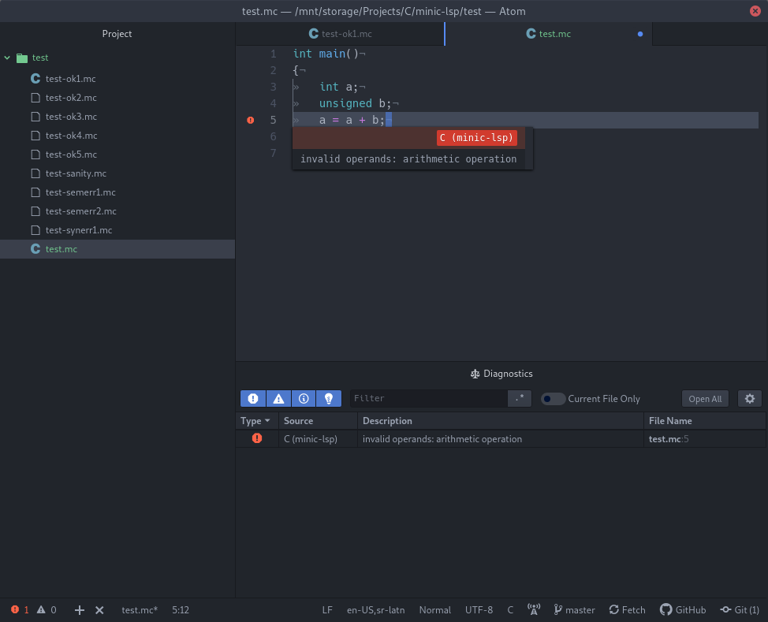

# minic-lsp-atom

Provides miniC language support for [Atom](https://atom.io/) using
[minic-lsp language server](https://github.com/BojanStipic/minic-lsp).



## minic-lsp

minic-lsp is a [Language Server](https://langserver.org/) implementation for the miniC programming language.
It is available under the GNU GPLv3 or later license, and can be found
[here](https://github.com/BojanStipic/minic-lsp).

## Prerequisites

* [Atom](https://atom.io/) 1.21 or later
* [atom-ide-ui](https://atom.io/packages/atom-ide-ui)
* [minic-lsp](https://github.com/BojanStipic/minic-lsp) executable installed in your `$PATH`

## Installation

```
apm install BojanStipic/minic-lsp-atom
```
